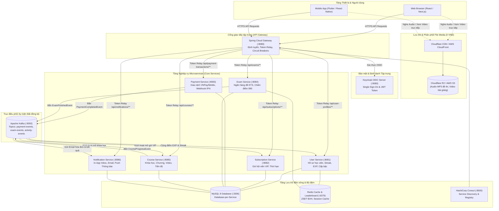

# Sơ đồ 1: Tổng quan Kiến trúc Hệ sinh thái Microservices TOEIC Pro

```mermaid
flowchart TB
    subgraph CLIENT_LAYER["Tầng Thiết bị & Người dùng"]
        WebClient["Web Browser (React / Next.js)"]
        MobileClient["Mobile App (Flutter / React Native)"]
    end

    subgraph CDN_STORAGE["Lưu trữ & Phân phối File Media (0 VNĐ)"]
        CDN["Cloudflare CDN / AWS CloudFront"]
        ObjectStorage[("Cloudflare R2 / AWS S3<br>(Audio MP3 đề thi, Video bài giảng)")]
        CDN --> ObjectStorage
    end

    subgraph AUTH_LAYER["Bảo mật & Định danh Tập trung"]
        Keycloak["Keycloak OIDC Server (:9080)<br>Single Sign-On & JWT Token"]
    end

    subgraph GATEWAY_LAYER["Cổng giao tiếp tập trung (API Gateway)"]
        Gateway["Spring Cloud Gateway (:8080)<br>Định tuyến, Token Relay, Circuit Breakers"]
    end

    subgraph SERVICES_LAYER["Tầng Nghiệp vụ Microservices (Core Services)"]
        UserService["User Service (:8081)<br>Hồ sơ học viên, Streak, EXP, Cấp bậc"]
        SubService["Subscription Service (:8082)<br>Gói hội viên VIP, Thời hạn"]
        PaymentService["Payment Service (:8083)<br>Giao dịch VNPay/MoMo, Webhook IPN"]
        ExamService["Exam Service (:8084)<br>Ngân hàng đề ETS, Chấm điểm 990"]
        CourseService["Course Service (:8085)<br>Khóa học, Chương, Video, Tiến độ"]
        NotiService["Notification Service (:8086)<br>In-App Inbox, Email, Push Thông báo"]
    end

    subgraph EVENT_BROKER["Trục điều phối Sự kiện Bất đồng bộ"]
        Kafka[("Apache Kafka (:9092)<br>Topics: payment-events, exam-events, activity-events")]
    end

    subgraph PERSISTENCE_CACHE["Tầng Lưu trữ Bền vững & Bộ đệm"]
        MySQL[("MySQL 8 Database (:3306)<br>Database-per-Service")]
        Redis[("Redis Cache & Leaderboard (:6379)<br>ZSET BXH, Session Cache")]
        Consul["HashiCorp Consul (:8500)<br>Service Discovery & Registry"]
    end

    %% Client Connections
    WebClient -->|HTTPS API Requests| Gateway
    MobileClient -->|HTTPS API Requests| Gateway
    WebClient -.->|Nghe Audio / Xem Video trực tiếp| CDN
    MobileClient -.->|Nghe Audio / Xem Video trực tiếp| CDN

    %% Gateway & Auth
    Gateway <-->|Xác thực OIDC| Keycloak
    Gateway -->|Token Relay /api/user-profiles/**| UserService
    Gateway -->|Token Relay /api/subscriptions/**| SubService
    Gateway -->|Token Relay /api/payment-transactions/**| PaymentService
    Gateway -->|Token Relay /api/exams/**| ExamService
    Gateway -->|Token Relay /api/courses/**| CourseService
    Gateway -->|Token Relay /api/notifications/**| NotiService

    %% Service to Infrastructure
    UserService --- MySQL
    SubService --- MySQL
    PaymentService --- MySQL
    ExamService --- MySQL
    CourseService --- MySQL
    NotiService --- MySQL

    UserService --- Redis
    ExamService --- Redis
    Gateway --- Consul

    %% Event Connections
    PaymentService -->|Bắn PaymentCompletedEvent| Kafka
    ExamService -->|Bắn ExamFinishedEvent| Kafka
    CourseService -->|Bắn CourseProgressEvent| Kafka

    Kafka -->|Kích hoạt mở khóa học| CourseService
    Kafka -->|Kích hoạt mở gói VIP| SubService
    Kafka -->|Gửi Email hóa đơn & kết quả| NotiService
    Kafka -->|Cộng điểm EXP & Streak| UserService
```
