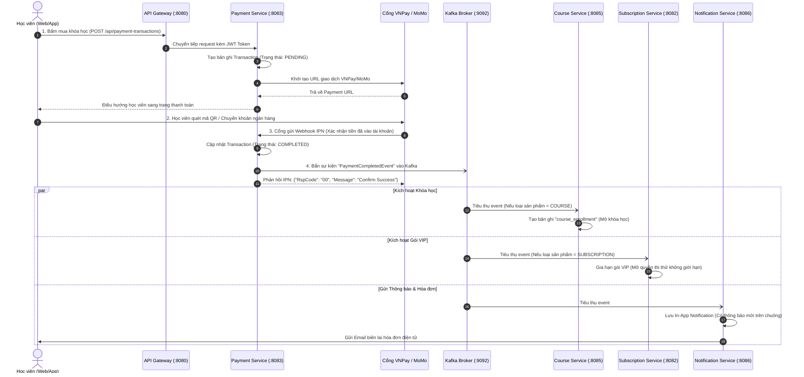

# Sơ đồ 2: Luồng Thanh toán VNPay/MoMo & Tự động Kích hoạt Khóa học / VIP

```mermaid
sequenceDiagram
    autonumber
    actor Student as Học viên (Web/App)
    participant GW as API Gateway (:8080)
    participant PS as Payment Service (:8083)
    participant PG as Cổng VNPay / MoMo
    participant K as Kafka Broker (:9092)
    participant CS as Course Service (:8085)
    participant SS as Subscription Service (:8082)
    participant NS as Notification Service (:8086)

    Student->>GW: 1. Bấm mua khóa học (POST /api/payment-transactions)
    GW->>PS: Chuyển tiếp request kèm JWT Token
    PS->>PS: Tạo bản ghi Transaction (Trạng thái: PENDING)
    PS->>PG: Khởi tạo URL giao dịch VNPay/MoMo
    PG-->>PS: Trả về Payment URL
    PS-->>Student: Điều hướng học viên sang trang thanh toán

    Student->>PG: 2. Học viên quét mã QR / Chuyển khoản ngân hàng
    PG->>PS: 3. Cổng gửi Webhook IPN (Xác nhận tiền đã vào tài khoản)
    PS->>PS: Cập nhật Transaction (Trạng thái: COMPLETED)
    
    %% Bất đồng bộ qua Kafka
    PS-)K: 4. Bắn sự kiện "PaymentCompletedEvent" vào Kafka
    PS-->>PG: Phản hồi IPN: {"RspCode": "00", "Message": "Confirm Success"}

    par Kích hoạt Khóa học
        K-)CS: Tiêu thụ event (Nếu loại sản phẩm = COURSE)
        CS->>CS: Tạo bản ghi "course_enrollment" (Mở khóa học)
    and Kích hoạt Gói VIP
        K-)SS: Tiêu thụ event (Nếu loại sản phẩm = SUBSCRIPTION)
        SS->>SS: Gia hạn gói VIP (Mở quyền thi thử không giới hạn)
    and Gửi Thông báo & Hóa đơn
        K-)NS: Tiêu thụ event
        NS->>NS: Lưu In-App Notification (Có thông báo mới trên chuông)
        NS->>Student: Gửi Email biên lai hóa đơn điện tử
    end
```
