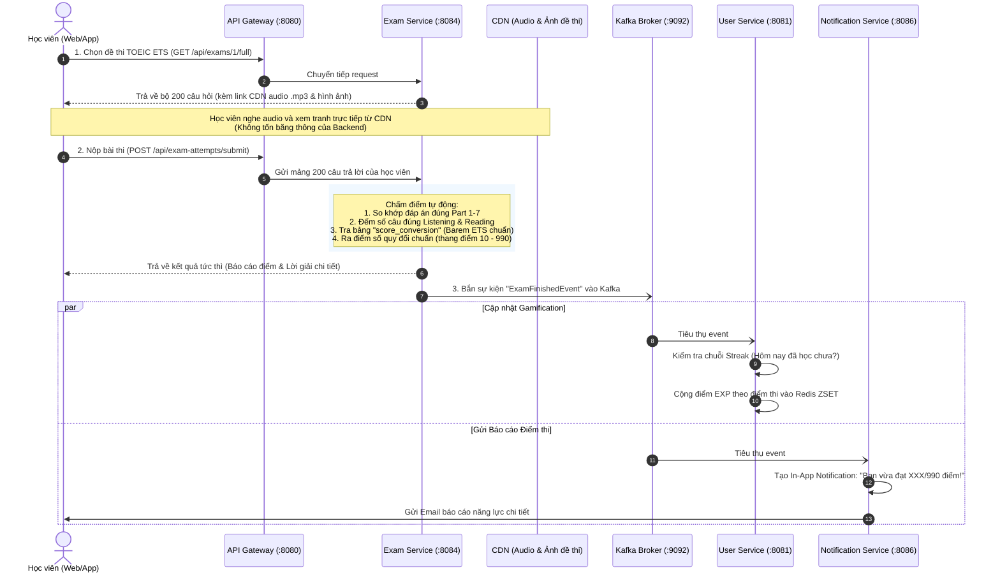

# Sơ đồ 3: Luồng Thi thử TOEIC & Chấm điểm Tự động theo Barem ETS 990

```mermaid
sequenceDiagram
    autonumber
    actor Student as Học viên (Web/App)
    participant GW as API Gateway (:8080)
    participant ES as Exam Service (:8084)
    participant CDN as CDN (Audio & Ảnh đề thi)
    participant K as Kafka Broker (:9092)
    participant US as User Service (:8081)
    participant NS as Notification Service (:8086)

    Student->>GW: 1. Chọn đề thi TOEIC ETS (GET /api/exams/1/full)
    GW->>ES: Chuyển tiếp request
    ES-->>Student: Trả về bộ 200 câu hỏi (kèm link CDN audio .mp3 & hình ảnh)
    
    Note over Student,CDN: Học viên nghe audio và xem tranh trực tiếp từ CDN<br>(Không tốn băng thông của Backend)

    Student->>GW: 2. Nộp bài thi (POST /api/exam-attempts/submit)
    GW->>ES: Gửi mảng 200 câu trả lời của học viên
    
    rect rgb(240, 248, 255)
        Note over ES: Chấm điểm tự động:<br>1. So khớp đáp án đúng Part 1-7<br>2. Đếm số câu đúng Listening & Reading<br>3. Tra bảng "score_conversion" (Barem ETS chuẩn)<br>4. Ra điểm số quy đổi chuẩn (thang điểm 10 - 990)
    end

    ES-->>Student: Trả về kết quả tức thì (Báo cáo điểm & Lời giải chi tiết)

    %% Bất đồng bộ qua Kafka
    ES-)K: 3. Bắn sự kiện "ExamFinishedEvent" vào Kafka

    par Cập nhật Gamification
        K-)US: Tiêu thụ event
        US->>US: Kiểm tra chuỗi Streak (Hôm nay đã học chưa?)
        US->>US: Cộng điểm EXP theo điểm thi vào Redis ZSET
    and Gửi Báo cáo Điểm thi
        K-)NS: Tiêu thụ event
        NS->>NS: Tạo In-App Notification: "Bạn vừa đạt XXX/990 điểm!"
        NS->>Student: Gửi Email báo cáo năng lực chi tiết
    end
```
