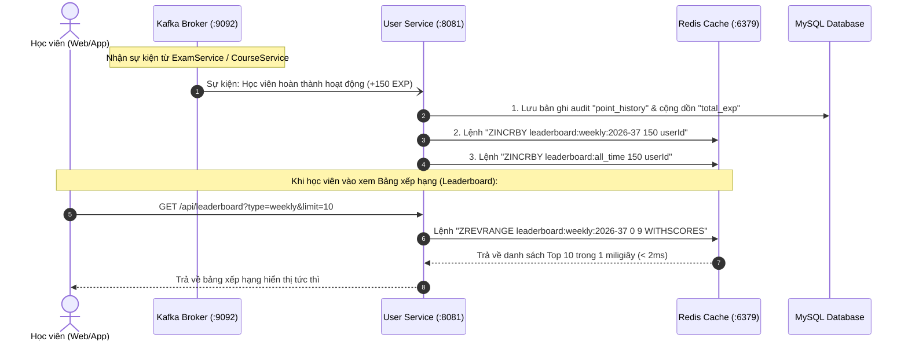

# Sơ đồ 4: Luồng Tích lũy Điểm EXP, Streak & Bảng xếp hạng Triệu người dùng với Redis

```mermaid
sequenceDiagram
    autonumber
    actor Student as Học viên (Web/App)
    participant K as Kafka Broker (:9092)
    participant US as User Service (:8081)
    participant Redis as Redis Cache (:6379)
    participant DB as MySQL Database

    Note over K: Nhận sự kiện từ ExamService / CourseService
    K-)US: Sự kiện: Học viên hoàn thành hoạt động (+150 EXP)
    
    US->>DB: 1. Lưu bản ghi audit "point_history" & cộng dồn "total_exp"
    US->>Redis: 2. Lệnh "ZINCRBY leaderboard:weekly:2026-37 150 userId"
    US->>Redis: 3. Lệnh "ZINCRBY leaderboard:all_time 150 userId"

    Note over Student,Redis: Khi học viên vào xem Bảng xếp hạng (Leaderboard):
    Student->>US: GET /api/leaderboard?type=weekly&limit=10
    US->>Redis: Lệnh "ZREVRANGE leaderboard:weekly:2026-37 0 9 WITHSCORES"
    Redis-->>US: Trả về danh sách Top 10 trong 1 miligiây (< 2ms)
    US-->>Student: Trả về bảng xếp hạng hiển thị tức thì
```
