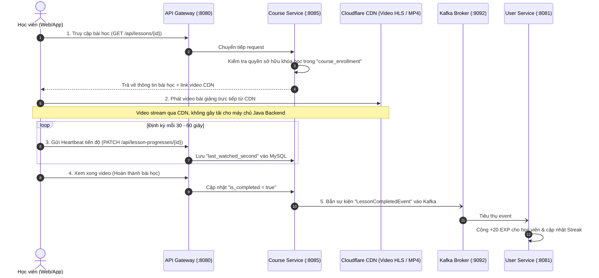

# Sơ đồ 5: Luồng Học trực tuyến, Stream Video & Ghi nhận Tiến độ (Learning Progress Flow)

```mermaid
sequenceDiagram
    autonumber
    actor Student as Học viên (Web/App)
    participant GW as API Gateway (:8080)
    participant CS as Course Service (:8085)
    participant CDN as Cloudflare CDN (Video HLS / MP4)
    participant K as Kafka Broker (:9092)
    participant US as User Service (:8081)

    Student->>GW: 1. Truy cập bài học (GET /api/lessons/{id})
    GW->>CS: Chuyển tiếp request
    CS->>CS: Kiểm tra quyền sở hữu khóa học trong "course_enrollment"
    CS-->>Student: Trả về thông tin bài học + link video CDN

    Student->>CDN: 2. Phát video bài giảng trực tiếp từ CDN
    Note over Student,CDN: Video stream qua CDN, không gây tải cho máy chủ Java Backend

    loop Định kỳ mỗi 30 - 60 giây
        Student->>GW: 3. Gửi Heartbeat tiến độ (PATCH /api/lesson-progresses/{id})
        GW->>CS: Lưu "last_watched_second" vào MySQL
    end

    Student->>GW: 4. Xem xong video (Hoàn thành bài học)
    GW->>CS: Cập nhật "is_completed = true"
    CS-)K: 5. Bắn sự kiện "LessonCompletedEvent" vào Kafka
    
    K-)US: Tiêu thụ event
    US->>US: Cộng +20 EXP cho học viên & cập nhật Streak
```
