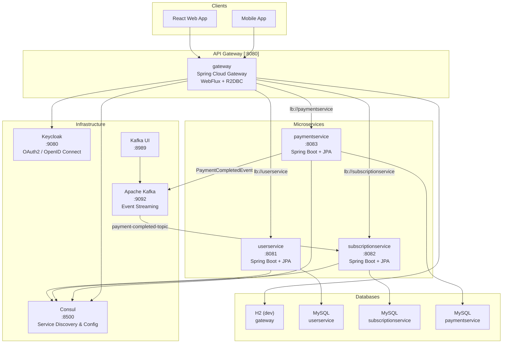
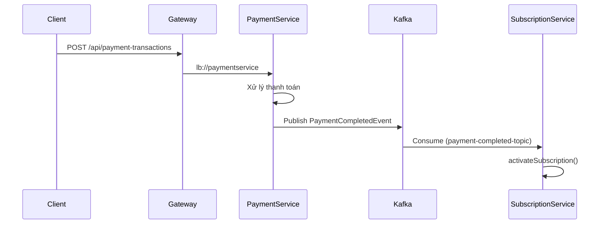

# Tổng Quan Kiến Trúc — Toeic Pro

## Topology

---

## Service Map

| Service | Port | Package | Database | Vai trò |
| :--- | :--- | :--- | :--- | :--- |
| **gateway** | 8080 | `com.toeic.gateway` | H2 (dev) | API Gateway, OAuth2 Login, React SPA hosting |
| **userservice** | 8081 | `com.toeic.user` | MySQL | Quản lý hồ sơ người dùng |
| **subscriptionservice** | 8082 | `com.toeic.subscription` | MySQL | Quản lý gói cước, đăng ký, giao dịch thanh toán nội bộ |
| **paymentservice** | 8083 | `com.toeic.payment` | MySQL | Xử lý thanh toán, webhook cổng thanh toán |

---

## Domain Models

### userservice
| Entity | Mô tả |
| :--- | :--- |
| `UserProfile` | userId, name, email, address, phone |

### subscriptionservice
| Entity | Mô tả |
| :--- | :--- |
| `Plan` | code, name, price, durationDays, features, isActive |
| `Subscription` | userId, status (TRIAL/ACTIVE/EXPIRED/CANCELLED), startsAt, expiresAt |
| `PaymentTransaction` | orderCode, gateway, gatewayTransId, amount, status |

**Quan hệ:** `Subscription` → ManyToOne → `Plan`, `PaymentTransaction` → ManyToOne → `Subscription`

### paymentservice
| Entity | Mô tả |
| :--- | :--- |
| `PaymentTransaction` | orderCode, gateway (VNPAY/MOMO/STRIPE), amount, status (PENDING/SUCCESS/FAILED) |
| `PaymentWebhookLog` | Log callback từ cổng thanh toán |

---

## API Routing (Gateway → Microservice)

### Explicit Routes (mới triển khai)
| Client gọi | Route tới | CircuitBreaker |
| :--- | :--- | :--- |
| `/api/user-profiles/**` | `lb://userservice` | `userserviceCB` |
| `/api/plans/**` | `lb://subscriptionservice` | `subscriptionserviceCB` |
| `/api/subscriptions/**` | `lb://subscriptionservice` | `subscriptionserviceCB` |
| `/api/payment-transactions/**` | `lb://paymentservice` | `paymentserviceCB` |
| `/api/payment-webhook-logs/**` | `lb://paymentservice` | `paymentserviceCB` |

### Discovery Locator (JHipster mặc định, backward compatible)
| Pattern | Ví dụ |
| :--- | :--- |
| `/services/{service-id}/**` | `/services/subscriptionservice/api/plans` |

---

## Communication Patterns

| Loại | Cơ chế | Use case |
| :--- | :--- | :--- |
| **Synchronous** | Gateway → `lb://service` (Consul) | Client request/response |
| **Asynchronous** | Kafka (`payment-completed-topic`) | Payment → Subscription activation |

---

## Tech Stack

| Layer | Công nghệ |
| :--- | :--- |
| **Language** | Java 21 |
| **Framework** | Spring Boot 4.1.1, JHipster 9.3.0 |
| **Gateway** | Spring Cloud Gateway (WebFlux) |
| **Service Discovery** | HashiCorp Consul |
| **Auth** | Keycloak (OAuth2 / OpenID Connect) |
| **Database** | MySQL (prod), H2 (gateway dev) |
| **ORM** | Spring Data JPA + Hibernate 7 |
| **Caching** | Redis + Caffeine |
| **Messaging** | Apache Kafka 3.8 |
| **Resilience** | Resilience4j (CircuitBreaker) |
| **Migration** | Liquibase |
| **Build** | Maven, Node.js (gateway frontend) |
| **Frontend** | React + Vite (hosted in gateway) |
| **Mapping** | MapStruct 1.6 |
| **Monitoring** | Micrometer + Prometheus |

---

## Infrastructure (Docker)

| Service | Image | Port |
| :--- | :--- | :--- |
| Kafka | `apache/kafka:3.8.0` | 9092 |
| Kafka UI | `provectuslabs/kafka-ui` | 8989 |
| Consul | (JHipster Docker) | 8500 |
| Keycloak | (JHipster Docker) | 9080 |
| MySQL | (per service Docker) | 3306 |
| Redis | (per service Docker) | 6379 |
