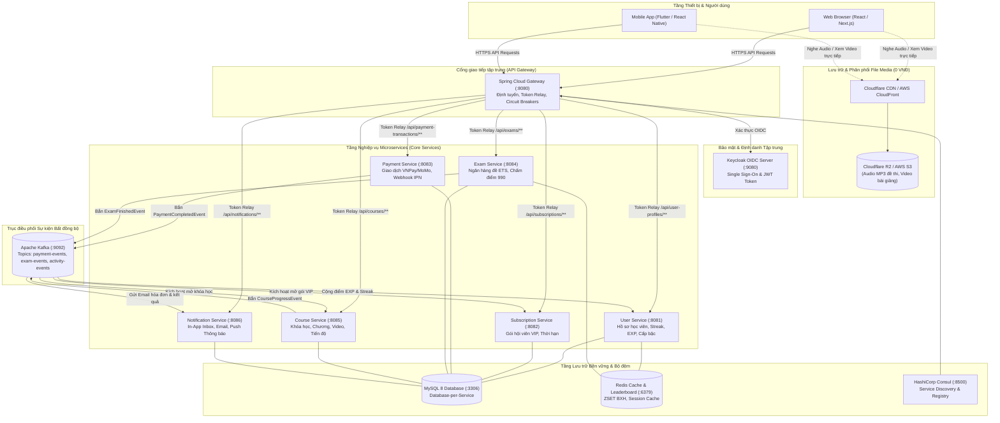
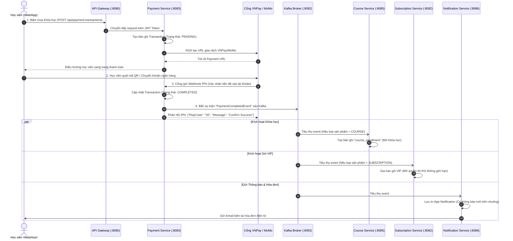
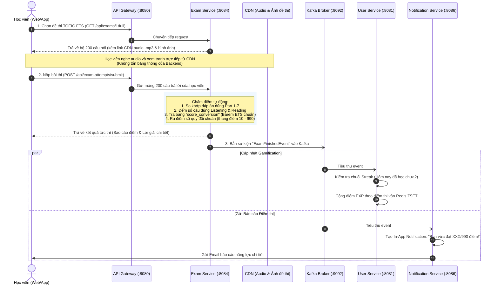
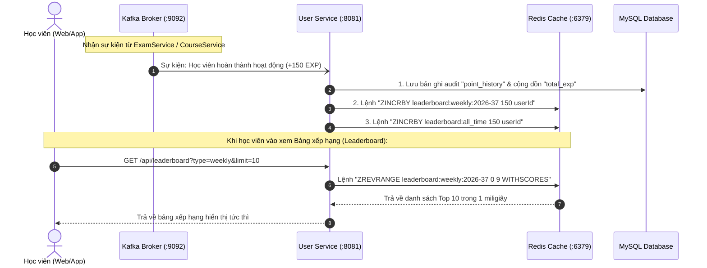

# Hệ sinh thái Microservices TOEIC Pro - Sơ đồ Luồng hoạt động Tổng quan
> Tài liệu kiến trúc và sơ đồ luồng dữ liệu (Data & Event Flows). Có thể xem trực tiếp bằng các công cụ Mermaid Viewer (VSCode, IntelliJ Markdown Plugin, hoặc [Mermaid Live Editor](https://mermaid.live)).

---

## 1. Sơ đồ Kiến trúc Hệ sinh thái Tổng thể (System Architecture Overview)

---

## 2. Luồng Nghiệp vụ 1: Mua Khóa học / Gói VIP & Tự động Kích hoạt (Payment Flow)

---

## 3. Luồng Nghiệp vụ 2: Thi thử TOEIC & Chấm điểm Tự động (Exam Flow)

---

## 4. Luồng Nghiệp vụ 3: Tích lũy Điểm EXP & Bảng xếp hạng Siêu tốc (Gamification Flow)

