# Sơ đồ Luồng Hoạt động Toàn hệ thống TOEIC Pro

Tài liệu mô tả kiến trúc tổng thể, cơ chế điều phối hạ tầng và các luồng giao tiếp (Đồng bộ, Bất đồng bộ, Lưu trữ Media) giữa các Microservices trong hệ thống TOEIC Pro.

---

## 1. Sơ đồ Kiến trúc & Luồng Dữ liệu Tổng thể

```mermaid
flowchart TD
    %% TẦNG 1: TRUY CẬP & GATEWAY
    subgraph ClientLayer ["1. TẦNG TRUY CẬP (CLIENT & API GATEWAY)"]
        User(["Học viên / Client Trình duyệt / Mobile"])
        Gateway["API Gateway (Port 8080)\n- Reverse Proxy & Dynamic Routing\n- Security Token Relay (JWT)\n- Host Single Page App (React/Vite)"]
    end

    %% TẦNG 2: BẢO MẬT & ĐIỀU PHỐI HẠ TẦNG
    subgraph InfraSecurity ["2. BẢO MẬT & ĐIỀU PHỐI (SECURITY & DISCOVERY)"]
        Keycloak[("Keycloak Auth Server :9080\n- Quản lý User/Role OIDC (Realm: jhipster)\n- Cấp phát & Xác thực JWT Token")]
        Consul[("Consul Registry & Config :8500\n- Service Discovery & Phân giải IP nội bộ\n- Heartbeat & Health Check tự động")]
    end

    %% TẦNG 3: CỤM MICROSERVICES (7 SERVICES)
    subgraph ServicesLayer ["3. CỤM DỊCH VỤ NGHIỆP VỤ (BUSINESS MICROSERVICES)"]
        UserService["userservice :8081\n- Hồ sơ cá nhân (UserProfile)\n- Mục tiêu điểm, Avatar"]
        SubService["subscriptionservice :8082\n- Quản lý gói VIP & Đơn giá\n- Tính ngày hết hạn (ACTIVE)"]
        PayService["paymentservice :8083\n- Giao dịch thanh toán\n- Nhận IPN Webhook VNPay/MoMo"]
        ExamService["examservice :8084\n- Đề thi TOEIC (Mở tự do cho mọi User)\n- Làm bài & Chấm điểm thi tự động"]
        CourseService["courseservice :8085\n- Khóa học, bài giảng, lộ trình học\n- Tài liệu & Video TOEIC"]
        NotifService["notificationservice :8086\n- Gửi Email / Thông báo đẩy\n- Template biên lai, kết quả thi"]
    end

    %% TẦNG 4: EVENT-DRIVEN MESSAGE BROKER
    subgraph KafkaBroker ["4. TRUYỀN THÔNG BẤT ĐỒNG BỘ (EVENT-DRIVEN KAFKA)"]
        Kafka[("Apache Kafka Broker :9092 / :29092\nTopics:\n- payment-completed-topic\n- exam-finished-topic\n- course-enrolled-topic")]
    end

    %% TẦNG 5: LƯU TRỮ OBJECT & CDN MEDIA
    subgraph MediaStorage ["5. LƯU TRỮ AUDIO & ẢNH ĐỀ THI (CLOUDFLARE R2)"]
        R2Storage[("Cloudflare R2 Object Storage\nBucket: 'toeic-sever'\n- Audio đề thi Listening Part 1-4 (.mp3)\n- Ảnh câu hỏi Part 1, biểu đồ Part 3,4,7\n- Băng thông tải ra 0đ (Zero Egress Fee)")]
    end

    %% TẦNG 6: CƠ SỞ DỮ LIỆU & CACHE
    subgraph StorageLayer ["6. LƯU TRỮ DỮ LIỆU & CACHE (DATABASE & CACHE)"]
        MySQL[("MySQL Server :3306\n(7 Databases độc lập theo từng Service)")]
        Redis[("Redis Cache :6379\n(Distributed Cache & Session Storage)")]
    end

    %% =========================================================================
    %% ĐỊNH NGHĨA CÁC LUỒNG TƯƠNG TÁC (FLOWS)
    %% =========================================================================

    %% 1. Truy cập & Đăng nhập
    User -->|"1. Truy cập Web & Yêu cầu Đăng nhập"| Gateway
    Gateway <-->|"2. Xác thực OIDC / Nhận JWT Token"| Keycloak

    %% 2. Tra cứu & Điều phối qua Consul
    Gateway <-->|"3. Tra cứu địa chỉ dịch vụ đích"| Consul
    ServicesLayer -.->|"Đăng ký & Báo cáo Health Check"| Consul

    %% 3. Gateway định tuyến kèm JWT Token
    Gateway -->|"4. Routing + Header Authorization: Bearer JWT"| UserService
    Gateway -->|"4. Routing + Header Authorization: Bearer JWT"| SubService
    Gateway -->|"4. Routing + Header Authorization: Bearer JWT"| PayService
    Gateway -->|"4. Routing + Header Authorization: Bearer JWT"| ExamService
    Gateway -->|"4. Routing + Header Authorization: Bearer JWT"| CourseService

    %% 4. Giao tiếp Đồng bộ (OpenFeign)
    ExamService -.->|"5. Đồng bộ OpenFeign qua Consul\n(Kiểm tra VIP khi dùng tính năng nâng cao: AI Explain, PDF Certificate)"| SubService

    %% 5. Giao tiếp Bất đồng bộ khi Thanh toán (Kafka)
    PayService ==>|"6. Giao dịch thành công (SUCCESS)\nPublish: PaymentCompletedEvent"| Kafka
    Kafka ==>|"7a. Consume Event:\nKích hoạt gói VIP (ACTIVE) & cộng thời hạn"| SubService
    Kafka ==>|"7b. Consume Event:\nGửi Email hóa đơn & biên lai thanh toán"| NotifService

    %% 6. Giao tiếp Bất đồng bộ khi Hoàn thành Thi (Kafka)
    ExamService ==>|"8. Nộp bài & Chấm điểm xong\nPublish: ExamFinishedEvent"| Kafka
    Kafka ==>|"9. Consume Event:\nGửi Email báo cáo điểm thi & phân tích"| NotifService

    %% 7. Luồng Quản lý & Phân phối File Media (Cloudflare R2)
    ExamService -->|"10. Quản trị viên Upload Audio / Ảnh đề thi\n(AWS S3 SDK API -> Bucket toeic-sever)"| R2Storage
    User -.->|"11. Học viên Stream Audio nghe đề thi & Xem ảnh trực tiếp từ CDN"| R2Storage

    %% 8. Tầng Lưu trữ Database & Cache
    ServicesLayer -->|"12. Đọc/Ghi dữ liệu (JPA/Hibernate)"| MySQL
    ServicesLayer -->|"13. Lưu trữ Cache phân tán & Session"| Redis
```

---

## 2. Chi tiết Các Luồng Hoạt động Trọng tâm

### Luồng 1: Xác thực & Bảo mật (Security & Token Relay)
1. Học viên đăng nhập qua giao diện Gateway (Port `8080`).
2. Gateway chuyển hướng sang **Keycloak (Port `9080`)** theo chuẩn OIDC Authorization Code Flow.
3. Keycloak xác thực và cấp phát cặp mã **Access Token (JWT)** & **Refresh Token**.
4. Gateway lưu giữ phiên bảo mật và tự động đính kèm header `Authorization: Bearer <JWT_TOKEN>` khi chuyển tiếp mọi request vào các microservice nghiệp vụ nội bộ (`userservice`, `examservice`,...).

---

### Luồng 2: Điều phối & Khám phá Dịch vụ (Consul Service Discovery)
1. Khi khởi động, mỗi microservice tự động đăng ký tên dịch vụ (`examservice`, `subscriptionservice`,...) và địa chỉ cổng với **Consul (Port `8500`)**.
2. Gateway và các Feign Client không cần cấu hình cứng IP/Port của các service khác, mà chỉ cần gọi qua tên định danh:
   - `http://subscriptionservice/api/...`
   - `http://examservice/api/...`
   Consul tự động cân bằng tải và giám sát trạng thái sức khỏe (Health check) của từng instance.

---

### Luồng 3: Giao tiếp Đồng bộ (Synchronous — OpenFeign qua Consul)
* **Vị trí tích hợp:** `examservice` (Client) $\longleftrightarrow$ `subscriptionservice` (Provider).
* **Đặc tả nghiệp vụ:**
  - **Mọi học viên (kể cả tài khoản thường / miễn phí)** đều được tham gia làm bài thi TOEIC tự do mà **không bị chặn**.
  - OpenFeign chỉ được kích hoạt khi học viên yêu cầu các **tính năng VIP nâng cao**:
    - Xem phân tích đáp án chi tiết từng câu bằng AI.
    - Xuất file PDF chứng nhận điểm thi TOEIC Pro.
    - Luyện các bộ đề thi dự đoán độc quyền (Mock Test VIP).
  - `examservice` gọi method Feign `subscriptionClient.isUserSubscriptionActive(userId)` để kiểm tra quyền hạn tức thì trong mili-giây.

---

### Luồng 4: Giao tiếp Bất đồng bộ hướng Sự kiện (Asynchronous — Kafka Events)
* **Vị trí tích hợp:** `paymentservice` (Producer) $\longrightarrow$ Kafka $\longrightarrow$ `subscriptionservice` & `notificationservice` (Consumers).
* **Quy trình hoạt động:**
  1. Học viên thanh toán gói VIP qua cổng VNPay / MoMo.
  2. `paymentservice` nhận IPN Webhook callback và cập nhật trạng thái giao dịch sang `SUCCESS`.
  3. [PaymentEventPublisher](file:///d:/Projects/Toeic_Pro/paymentservice/src/main/java/com/toeic/payment/service/PaymentEventPublisher.java) bắn sự kiện `PaymentCompletedEvent` (orderCode, userId, subscriptionId, amount, gateway, paidAt) vào topic `payment-completed-topic`.
  4. **Tại `subscriptionservice`:** [PaymentEventListener](file:///d:/Projects/Toeic_Pro/subscriptionservice/src/main/java/com/toeic/subscription/service/PaymentEventListener.java) bắt event $\rightarrow$ gọi `activateSubscription(...)` chuyển trạng thái sang `ACTIVE` và tính ngày hết hạn dựa trên thời gian gói (`durationDays`).
  5. **Tại `notificationservice`:** Bắt cùng event đó $\rightarrow$ kích hoạt gửi email biên lai thanh toán thành công cho học viên.

---

### Luồng 5: Quản lý & Tải File Âm thanh / Hình ảnh (Cloudflare R2 Storage)
* **Bucket định danh:** `toeic-sever`
* **Quy trình Upload (Admin / Giáo viên):**
  1. Gọi API `POST /api/storage/upload/audio` hoặc `POST /api/storage/upload/image` trên [examservice](file:///d:/Projects/Toeic_Pro/examservice).
  2. [FileStorageService](file:///d:/Projects/Toeic_Pro/examservice/src/main/java/com/toeic/exam/service/FileStorageService.java) sử dụng thư viện **AWS S3 SDK v2** đẩy trực tiếp file lên bucket `toeic-sever` trên Cloudflare R2 qua kết nối mã hóa HTTPS.
  3. API trả về URL file hoàn chỉnh để lưu vào database của câu hỏi:
     - `audioUrl`: file MP3 nghe từng câu Part 1, 2.
     - `imageUrl`: ảnh câu hỏi Part 1, bảng biểu Part 3, 4, 7.
     - `audioFullUrl`: file MP3 toàn bài thi Listening 45 phút.
* **Quy trình Phát (Client Streaming):**
  - Trình duyệt/App của học viên đọc trực tiếp URL từ Cloudflare R2 CDN với tốc độ tải cao và **0đ phí băng thông (Zero Egress Fee)**.

---

### Luồng 6: Tầng Lưu trữ & Caching (MySQL & Redis)
* **MySQL 8.4 (Port 3306):**
  - Kiến trúc Database-per-Service: 7 Database vật lý độc lập (`gateway`, `userservice`, `subscriptionservice`, `paymentservice`, `examservice`, `courseservice`, `notificationservice`).
  - Đảm bảo tính cô lập, không service nào truy cập trực tiếp vào DB của service khác.
* **Redis 8.10 (Port 6379):**
  - Lưu cache danh mục đề thi, bộ câu hỏi thường xuyên truy xuất, phiên đăng nhập và quota giới hạn tốc độ gọi API (Rate Limiting).
