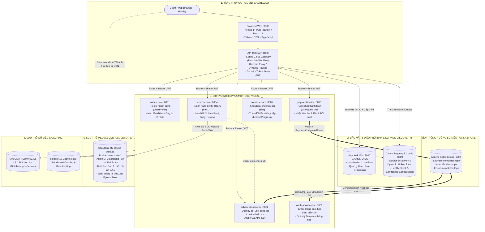

# TOEIC Pro — Nền tảng Luyện thi & Học TOEIC Trực tuyến (Microservices Architecture)

Hệ thống luyện thi và đào tạo TOEIC chuẩn quốc tế xây dựng trên kiến trúc **Microservices phân tán**, đảm bảo tính mở rộng cao (high scalability), khả năng chịu lỗi (fault tolerance), bảo mật OIDC/OAuth2 và tối ưu chi phí hạ tầng (Zero Egress CDN/Storage).

---

## 1. Sơ đồ Kiến trúc Tổng thể (System Architecture)



---

## 2. Bảng Danh mục Dịch vụ & Cổng Mạng (Port Mapping)

| Dịch vụ / Hạ tầng | Cổng Host | Vai trò & Trách nhiệm chính |
| :--- | :--- | :--- |
| **frontend** | `3000` | Ứng dụng Web Client cho học viên (Next.js App Router). |
| **gateway** | `8080` | API Gateway duy nhất tiếp nhận request từ Client, kiểm tra bảo mật, định tuyến động. |
| **userservice** | `8081` | Quản lý User Profile, Avatar, Mục tiêu điểm TOEIC, OTP xác thực. |
| **subscriptionservice** | `8082` | Quản lý gói cước (Plans), trạng thái thuê bao VIP, gia hạn tự động. |
| **paymentservice** | `8083` | Tích hợp cổng thanh toán (VNPay, MoMo), xử lý webhook IPN, xuất bản event Kafka. |
| **examservice** | `8084` | Quản lý kho đề thi 7 Parts, làm bài trắc nghiệm, chấm điểm tự động, upload media R2. |
| **courseservice** | `8085` | Quản lý khóa học, bài học, video bài giảng, ghi nhận tiến độ học từng học viên. |
| **notificationservice** | `8086` | Gửi Email / Thông báo đẩy khi thanh toán thành công, nộp bài thi, nhắc lịch học. |
| **consul** | `8500` | Service Discovery, Registry và Centralized Configuration Server. |
| **keycloak** | `9080` | Identity & Access Management (IAM), cấp phát token OIDC JWT, quản trị User/Role. |
| **mysql** | `3306` | Cơ sở dữ liệu quan hệ MySQL 8.4 (Database-per-Service: 7 DB tách biệt). |
| **redis** | `6379` | Bộ nhớ đệm phân tán Redis 8.10 (Cache kết quả truy vấn, Rate limiting). |
| **kafka** | `9092` | Event Streaming Platform điều phối giao tiếp bất đồng bộ giữa các microservices. |
| **kafka-ui** | `8989` | Dashboard trực quan quản lý Topics, Consumer Groups và Messages Kafka. |

---

## 3. Techstack Chi tiết

### Frontend
- **Framework:** Next.js 14 (App Router), React 18.
- **Language:** TypeScript 5.
- **Styling & UI:** Tailwind CSS, PostCSS, Lucide React Icons.
- **Networking:** Fetch API / Next Server Actions tích hợp Gateway reverse-proxy.

### Backend Microservices
- **Core Platform:** Java 25 (Temurin JRE), Spring Boot 3 / JHipster 9.
- **Gateway & Reactive:** Spring Cloud Gateway (Spring WebFlux, Project Reactor, R2DBC).
- **Security:** Spring Security OAuth2 Resource Server (JWT validation, Stateless), Keycloak OIDC.
- **Data Persistence:** Spring Data JPA, Hibernate ORM, Liquibase (Schema version control & migrations).
- **Communication:**
  - **Đồng bộ (Synchronous):** Spring Cloud OpenFeign + Consul Discovery.
  - **Bất đồng bộ (Asynchronous):** Spring Kafka, Apache Kafka 3.8.
- **Media & Cloud Storage:** AWS S3 SDK v2 (`S3AsyncClient`, `S3Client`) tích hợp Cloudflare R2 Storage.
- **Build Tool:** Apache Maven 3.

### Hạ tầng & DevOps (Infrastructure)
- **Containerization:** Docker, Docker Compose orchestration (`docker-compose-all.yml`).
- **Identity Provider:** Keycloak 26 (Realm: `jhipster`, OIDC Authorization Code Flow).
- **Service Mesh / Discovery:** HashiCorp Consul 2.0.
- **Database:** MySQL 8.4 (InnoDB, Full-text Search index trên bảng Exam).
- **Cache:** Redis 8.10.
- **Message Broker:** Apache Kafka 3.8 (Kraft mode, 3 partitions/topic, Dead Letter Topic support).
- **Object Storage & CDN:** Cloudflare R2 (S3-compatible, Zero Egress Fee).

---

## 4. Các Luồng Hoạt động Trọng tâm (Core Flows)

### 4.1. Xác thực & Phân quyền (Authentication & Authorization)
1. Client gửi yêu cầu đăng nhập $\rightarrow$ Gateway chuyển hướng sang Keycloak (Port 9080).
2. Keycloak xác thực qua OIDC Authorization Code Flow và cấp phát JWT Token (`preferred_username`, `roles`).
3. Gateway chuyển tiếp request đến microservice kèm header `Authorization: Bearer <JWT_TOKEN>`.
4. Mỗi service sử dụng `SecurityUtils` và `@PreAuthorize` để kiểm tra phân quyền (ROLE_ADMIN, ROLE_USER) và quyền sở hữu tài nguyên (IDOR prevention).

### 4.2. Quản lý & Làm bài thi TOEIC (Exam & Scoring)
1. **Duyệt đề thi:** Học viên chỉ xem và tìm kiếm các bộ đề đã xuất bản (`isPublished = true`). Đề nháp chỉ Admin được xem.
2. **Làm bài (`/api/exams/{id}/take`):** Endpoint trả về cấu trúc câu hỏi gọn nhẹ (`QuestionTakeDTO`) **không chứa** đáp án đúng (`correctOption`) và lời giải (`explanation`) để chống gian lận.
3. **Nộp bài (`/api/exam-attempts/{id}/submit`):**
   - Lấy lock `findOneForUpdate` chống nộp trùng / race condition.
   - `ExamScoringEngine` tự động chấm điểm Listening và Reading theo bảng quy đổi điểm TOEIC chuẩn (chuẩn 990 điểm).
   - Lưu bài làm bằng batch insert qua `UserAnswerBatchRepository`.
4. **Xem lại (`/api/exam-attempts/{id}/review`):** Chỉ người làm bài hoặc Admin mới có quyền xem lại kết quả và lời giải chi tiết.

### 4.3. Thanh toán & Kích hoạt gói VIP (Event-Driven Kafka)
1. Học viên tạo giao dịch thanh toán gói VIP qua cổng thanh toán tích hợp trong `paymentservice`.
2. Khi nhận IPN Webhook callback thành công (`SUCCESS`):
   - `paymentservice` cập nhật trạng thái đơn hàng.
   - `PaymentEventPublisher` bắn sự kiện `PaymentCompletedEvent` vào topic `payment-completed-topic`.
3. `subscriptionservice` lắng nghe event $\rightarrow$ tự động kích hoạt gói VIP (`ACTIVE`) và tính toán ngày hết hạn (`endDate = now + durationDays`).
4. `notificationservice` lắng nghe cùng event $\rightarrow$ sinh email biên lai và gửi thông báo xác nhận cho học viên.

### 4.4. Quản lý File Âm thanh & Hình ảnh (Cloudflare R2)
- Admin upload file âm thanh (`.mp3`) hoặc hình ảnh qua `examservice` bằng AWS S3 SDK v2 bất đồng bộ.
- File được lưu trữ trên Cloudflare R2 Bucket `toeic-sever`.
- Học viên nghe audio và tải hình ảnh bài thi trực tiếp từ Cloudflare CDN với độ trễ thấp và hoàn toàn miễn phí băng thông chiều tải ra.

---

## 5. Cấu trúc Thư mục Dự án

```text
Toeic_Pro/
├── docker-compose-all.yml         # File Docker Compose khởi chạy toàn bộ hệ thống
├── docker-compose-kafka.yml       # Docker Compose chạy độc lập cụm Kafka & Kafka UI
├── .env                           # Biến môi trường chung (Cloudflare R2, DB credentials)
│
├── frontend/                      # Ứng dụng Web Client (Next.js 14, React 18, Tailwind CSS)
├── gateway/                       # API Gateway (Spring Cloud Gateway, Port 8080)
├── userservice/                   # User Profile & Target Service (Port 8081)
├── subscriptionservice/           # Subscription & VIP Plan Service (Port 8082)
├── paymentservice/                # Payment Transaction & Webhook Service (Port 8083)
├── examservice/                   # Exam, Question Bank & Scoring Service (Port 8084)
├── courseservice/                 # Course, Lesson & Progress Service (Port 8085)
├── notificationservice/           # Notification & Email Template Service (Port 8086)
└── .doc/                          # Tài liệu thiết kế hệ thống, file SQL seed, template đề thi mẫu
```

---

## 6. Hướng dẫn Khởi chạy Hệ thống

### 6.1. Yêu cầu Môi trường
- **Docker & Docker Compose** (khuyên dùng Docker Desktop bản mới nhất).
- **JDK 25** (nếu chạy build local bằng Maven).
- **Node.js 20+** & **npm** (nếu chạy frontend local).

### 6.2. Khởi chạy toàn bộ hệ thống bằng Docker Compose
Chạy toàn bộ cụm Hạ tầng (MySQL, Redis, Consul, Keycloak, Kafka) và 7 Microservices + Frontend chỉ bằng 1 câu lệnh:

```bash
docker compose -f docker-compose-all.yml up -d
```

### 6.3. Kiểm tra Trạng thái Dịch vụ
- **API Gateway:** [http://localhost:8080](http://localhost:8080)
- **Frontend App:** [http://localhost:3000](http://localhost:3000)
- **Consul Discovery UI:** [http://localhost:8500](http://localhost:8500)
- **Keycloak Admin Console:** [http://localhost:9080](http://localhost:9080) *(Tài khoản: `admin` / `admin`)*
- **Kafka UI:** [http://localhost:8989](http://localhost:8989)
- **Health Check Endpoint:** `http://localhost:8080/management/health`
